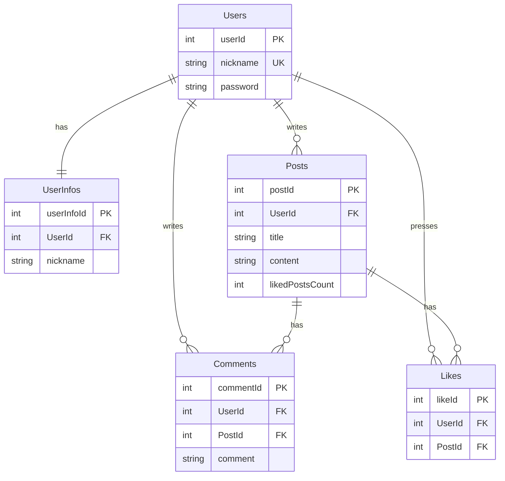

# Node.js 게시판 API — Layered Architecture

Express와 Sequelize(MySQL)로 만든 게시판 REST API입니다.
회원가입/로그인, 게시글 CRUD, 댓글 CRUD, 게시글 좋아요 기능을 제공하며
**Router → Controller → Service → Repository** 3계층 구조로 작성했습니다.

## 기술 스택

| 구분      | 사용 기술                  |
| --------- | -------------------------- |
| Runtime   | Node.js                    |
| Framework | Express 4                  |
| Database  | MySQL (AWS RDS)            |
| ORM       | Sequelize 6, sequelize-cli |
| 인증      | JWT (jsonwebtoken), Cookie |

## 폴더 구조

```
.
├── .env.example            # 환경 변수 예시
├── .sequelizerc            # sequelize-cli 경로 설정 (src/ 하위를 바라보도록)
├── package.json
└── src
    ├── app.js              # 서버 진입점
    ├── config
    │   └── config.js       # DB 접속 정보 (.env에서 읽음)
    ├── routes              # URL ↔ 컨트롤러 매핑
    │   ├── index.js
    │   ├── users.route.js
    │   ├── posts.route.js
    │   ├── comments.route.js
    │   └── likes.route.js
    ├── controllers         # 요청 파싱, 응답 반환
    ├── services            # 비즈니스 로직 (검증, 권한 확인, 응답 데이터 가공)
    ├── repositories        # Sequelize 모델을 통한 DB 접근
    ├── models              # Sequelize 모델 정의
    ├── migrations          # 테이블 생성 마이그레이션
    ├── middlewares
    │   ├── auth-middleware.js  # JWT 쿠키 검증 → res.locals.user
    │   └── error-handler.js    # 에러 → HTTP 응답 변환
    └── utils
        └── http-error.js   # 상태 코드를 담는 커스텀 에러
```

### 계층별 역할

```
Client ──► Router ──► Controller ──► Service ──► Repository ──► DB
                          ▲             │
                          └─ next(err) ─┘ (HttpError) ──► error-handler
```

- **Controller**: `req`에서 값을 꺼내 서비스를 호출하고, 결과를 응답으로 보냅니다.
- **Service**: 입력 검증, 존재 여부(404)·작성자 권한(403) 확인, 응답 형태 가공을 담당합니다. 실패 시 `HttpError`를 던집니다.
- **Repository**: Sequelize 쿼리만 담당합니다. 여러 테이블을 함께 바꾸는 작업(회원가입, 좋아요 + 좋아요 수)은 트랜잭션으로 묶습니다.
- **error-handler**: `HttpError`는 해당 상태 코드로, 그 외 에러는 500으로 응답합니다.

## ERD

[drawSQL에서 보기](https://drawsql.app/teams/5-8/diagrams/lv/embed)



- 모든 테이블에 `createdAt`, `updatedAt` 컬럼이 있습니다.
- 사용자·게시글이 삭제되면 연관 데이터도 함께 삭제됩니다(`ON DELETE CASCADE`).
- `Likes`는 `(UserId, PostId)` 유니크 인덱스로 같은 게시글에 중복 좋아요를 막습니다.

## API 명세

모든 경로는 `/api`로 시작합니다. 🔒 표시는 로그인(쿠키 `authorization: Bearer <JWT>`)이 필요한 API입니다.

### 회원

| Method | URL       | 설명                      | Request Body                      |
| ------ | --------- | ------------------------- | --------------------------------- |
| POST   | `/signup` | 회원가입                  | `{ nickname, password, confirm }` |
| POST   | `/login`  | 로그인 (쿠키에 토큰 발급) | `{ nickname, password }`          |

- 닉네임: 3자 이상, 영문 대소문자·숫자만
- 비밀번호: 4자 이상, 닉네임을 포함할 수 없음

### 게시글

| Method | URL                 | 설명                   | Request Body         |
| ------ | ------------------- | ---------------------- | -------------------- |
| POST   | `/posts` 🔒         | 게시글 작성            | `{ title, content }` |
| GET    | `/posts`            | 게시글 목록 (최신순)   |                      |
| GET    | `/posts/:postId`    | 게시글 상세            |                      |
| PUT    | `/posts/:postId` 🔒 | 게시글 수정 (작성자만) | `{ title, content }` |
| DELETE | `/posts/:postId` 🔒 | 게시글 삭제 (작성자만) |                      |

### 댓글

| Method | URL                                     | 설명                 | Request Body  |
| ------ | --------------------------------------- | -------------------- | ------------- |
| POST   | `/posts/:postId/comments` 🔒            | 댓글 작성            | `{ comment }` |
| GET    | `/posts/:postId/comments`               | 댓글 목록 (최신순)   |               |
| GET    | `/posts/:postId/comments/:commentId`    | 댓글 상세            |               |
| PUT    | `/posts/:postId/comments/:commentId` 🔒 | 댓글 수정 (작성자만) | `{ comment }` |
| DELETE | `/posts/:postId/comments/:commentId` 🔒 | 댓글 삭제 (작성자만) |               |

### 좋아요

| Method | URL                      | 설명                                    |
| ------ | ------------------------ | --------------------------------------- |
| POST   | `/posts/:postId/like` 🔒 | 좋아요 등록 / 이미 눌렀다면 취소 (토글) |
| GET    | `/like` 🔒               | 내가 좋아요한 게시글 목록               |

### 응답 형식

```jsonc
// 조회·생성 성공
{ "data": { ... } }
// 수정·삭제 등 성공 메시지
{ "message": "게시글 수정을 완료하였습니다." }
// 실패 (400 / 401 / 403 / 404 / 409 / 500)
{ "errorMessage": "게시글을 찾을 수 없습니다." }
```

## 실행 방법

```bash
# 1. 패키지 설치
npm install

# 2. 환경 변수 설정 — .env.example을 복사한 뒤 값을 채웁니다.
cp .env.example .env

# 3. DB 생성 및 테이블 마이그레이션
npm run db:create
npm run db:migrate

# 4. 서버 실행 (기본 포트 3018)
npm run dev     # nodemon
npm start       # node
```

### 환경 변수

| 이름                         | 설명                     |
| ---------------------------- | ------------------------ |
| `PORT`                       | 서버 포트 (기본값 3018)  |
| `DB_HOST`, `DB_PORT`         | MySQL 호스트, 포트       |
| `DB_USERNAME`, `DB_PASSWORD` | MySQL 계정               |
| `DB_DATABASE`                | 사용할 데이터베이스 이름 |
| `JWT_SECRET`                 | JWT 서명 키              |

## 해야 할 일

- 비밀번호가 평문으로 저장됩니다 → `bcrypt` 해싱 적용 필요
- JWT에 만료 시간이 없습니다 → `expiresIn` 및 Refresh Token 도입
- 요청 값 검증이 서비스에 직접 작성되어 있습니다 → Joi 등 검증 라이브러리 도입
- 테스트 코드가 없습니다 → Jest로 서비스·리포지토리 단위 테스트 작성
